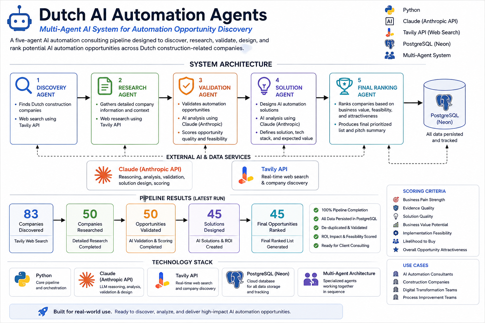

# Dutch AI Automation Agents

## Multi-Agent AI System for Automation Opportunity Discovery

A five-agent AI automation consulting pipeline designed to discover, research, validate, design, and rank potential AI automation opportunities across Dutch construction-related companies.
## System Architecture


## 📊 Verified Pipeline Results

The system was executed against a dataset of Dutch construction-related companies and successfully progressed companies through the multi-agent pipeline.

| Pipeline Stage | Result |
|---|---:|
| Companies discovered | **83** |
| Companies researched | **50** |
| Companies validated | **50** |
| Solutions generated | **45** |
| Final opportunities ranked | **45** |

### Pipeline Completion

```text
83 Companies Discovered
          ↓
50 Companies Researched
          ↓
50 Companies Validated
          ↓
45 Solutions Generated
          ↓
45 Final Opportunities Ranked
The system combines web research, LLM-based analysis, structured data, and PostgreSQL to turn a broad business research problem into a prioritized list of actionable automation opportunities.

---

## 🎯 Project Objective

The goal of this project is to automate an early-stage AI consulting workflow:

> **Which companies could benefit from AI automation, what problems could be automated, and which opportunities are worth pursuing first?**

Instead of manually researching companies one by one, the system uses multiple specialized AI agents to move companies through a structured discovery and evaluation pipeline.

---

## 🧠 Five-Agent Architecture

The system consists of five specialized agents.

### 1. Discovery Agent

Identifies Dutch construction-related companies using web search and AI-assisted analysis.

**Responsibilities:**

- Search for relevant Dutch companies
- Collect company information
- Identify company websites and source URLs
- Estimate company size
- Store discovered companies in PostgreSQL
- Prevent duplicate companies

---

### 2. Research Agent

Investigates the companies discovered by Agent 1.

**Responsibilities:**

- Research company activities
- Analyze publicly available information
- Identify operational characteristics
- Collect evidence relevant to potential automation opportunities
- Store structured research results

---

### 3. Validation Agent

Evaluates whether identified opportunities represent legitimate automation opportunities.

**Responsibilities:**

- Analyze research findings
- Determine whether an automation opportunity exists
- Assess potential business value
- Reject weak or unsupported opportunities
- Store validation results

The validation stage acts as a gate in the pipeline. Companies that do not represent credible automation opportunities do not proceed to solution design.

---

### 4. Solution Agent

Transforms validated opportunities into potential AI automation solutions.

**Responsibilities:**

- Identify suitable automation approaches
- Define the proposed solution
- Connect business problems to AI and automation capabilities
- Evaluate potential implementation value
- Store proposed solutions

---

### 5. Final Ranking Agent

Prioritizes the strongest opportunities.

**Responsibilities:**

- Evaluate validated opportunities and proposed solutions
- Score automation opportunities
- Rank opportunities by potential value
- Produce the final prioritized opportunity dataset

---

## 🔄 Pipeline Architecture

```text
                         ┌──────────────────────┐
                         │   Dutch Companies    │
                         └───────────┬──────────┘
                                     │
                                     ▼
                         ┌──────────────────────┐
                         │  1. Discovery Agent  │
                         │                      │
                         │ Find target          │
                         │ companies            │
                         └───────────┬──────────┘
                                     │
                                     ▼
                         ┌──────────────────────┐
                         │   2. Research Agent  │
                         │                      │
                         │ Research companies   │
                         │ and operations       │
                         └───────────┬──────────┘
                                     │
                                     ▼
                         ┌──────────────────────┐
                         │ 3. Validation Agent  │
                         │                      │
                         │ Validate whether     │
                         │ opportunity exists   │
                         └───────────┬──────────┘
                                     │
                         ┌───────────┴───────────┐
                         │                       │
                         ▼                       ▼
                    REJECTED                 VALIDATED
                         │                       │
                         │                       ▼
                         │            ┌──────────────────────┐
                         │            │  4. Solution Agent   │
                         │            │                      │
                         │            │ Design AI /          │
                         │            │ automation solution  │
                         │            └───────────┬──────────┘
                         │                        │
                         │                        ▼
                         │            ┌──────────────────────┐
                         │            │ 5. Final Ranking     │
                         │            │       Agent          │
                         │            │                      │
                         │            │ Score and prioritize │
                         │            │ opportunities        │
                         │            └───────────┬──────────┘
                         │                        │
                         │                        ▼
                         │            ┌──────────────────────┐
                         │            │ Prioritized AI       │
                         │            │ Automation           │
                         │            │ Opportunities        │
                         │            └──────────────────────┘
                         │
                         ▼
                  Validation stops
                  the opportunity
                  ---

## 🔎 Example Results

The pipeline generated and ranked **45 AI automation opportunities** across Dutch construction-related companies.

The final ranking stage prioritizes opportunities based on business value and implementation difficulty.

### Top Opportunities Identified

| Company | AI Automation Opportunity | Business Value | Difficulty |
|---|---|---:|---|
| Van Wijnen | Intelligent Prefab Compatibility Validator | 74 | High |
| Dura Vermeer | Cross-Entity Project Budgeting & Cost Intelligence Assistant | 68 | Medium |
| TBI | Automated Scope 3 CSRD Data Collection & Reporting Hub | 68 | Medium |
| TBI Holdings | TBI Sustainability & Waste Data Automation Hub | 66 | Medium |
| Strukton | Intelligent Invoice & Procurement Automation Hub | 62 | Medium |
| Aalberts integrated piping systems | Manufacturing Knowledge Assistant & Cross-Site Documentation Hub | 62 | Medium |
| Heerema Fabrication Group | AI-Assisted Welding Quality Documentation & Procurement Intelligence Assistant | 62 | Medium |
| BESIX | QHSE Intelligence Copilot for OASIS | 62 | Medium |
| Koninklijke BAM Groep | Unified Project Data & Risk Intelligence Hub | 62 | High |
| Wavin | Export & Trade Documentation AI Copilot | 62 | High |

### Example: Van Wijnen

**Opportunity:** Intelligent Prefab Compatibility Validator

The system identified an opportunity to use AI-assisted rule validation to accelerate compatibility checking of prefabricated housing elements.

The proposed solution would analyze proposed configurations against relevant engineering and production rules and flag potential conflicts before they reach the factory floor.

**Business Value:** 74  
**Implementation Difficulty:** High

### Example: Dura Vermeer

**Opportunity:** Cross-Entity Project Budgeting & Cost Intelligence Assistant

The system identified an opportunity to standardize project budgeting and cost intelligence across multiple entities.

The proposed solution would use AI to ingest cost and pricing information, identify budget deviations, and provide project managers with natural-language explanations and recommendations.

**Business Value:** 68  
**Implementation Difficulty:** Medium

### Example: Wavin

**Opportunity:** Export & Trade Documentation AI Copilot

The system identified an opportunity to automate repetitive export and shipping documentation.

The proposed solution would retrieve order information from existing systems, generate and validate export documents, apply country-specific compliance rules through a RAG knowledge base, and flag discrepancies before shipment.

**Business Value:** 62  
**Implementation Difficulty:** High

> **Note:** These results are AI-generated opportunity hypotheses produced by the research, validation, solution, and ranking pipeline. They should be treated as consulting opportunities for further validation rather than claims that the companies have formally confirmed these exact problems or solutions.

---

## 📊 Output

The pipeline produces structured opportunity data that can be exported for further analysis and prioritization.

The resulting dataset can be used by an AI consultant to:

- Identify high-value automation opportunities
- Compare implementation difficulty
- Prioritize potential client engagements
- Investigate specific business processes
- Develop AI automation proposals